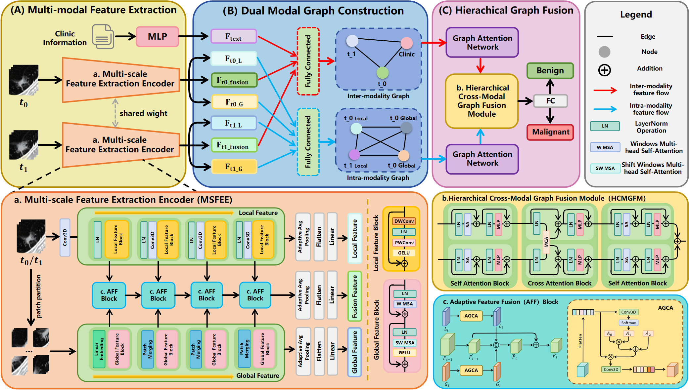
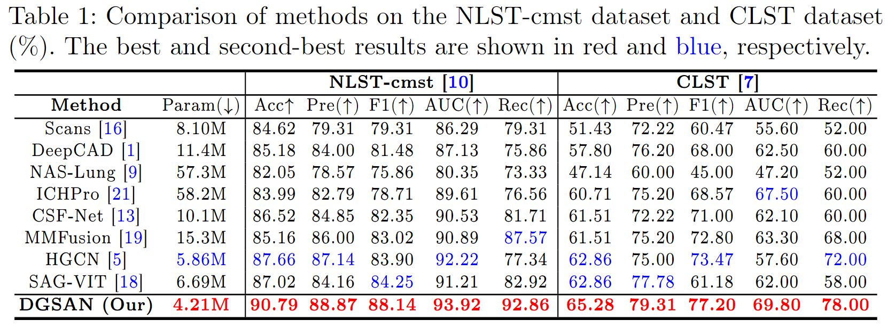

# DGSAN: Dual-Graph Spatiotemporal Attention Network for Pulmonary Nodule Malignancy Prediction

The overall framework of our proposed DGSAN:



Comparison of different SOTA methods on the NLST-cmst dataset and CLST dataset:



## Pre-requisties

- Linux

- Python>=3.7

- NVIDIA GPU + CUDA12.1 cuDNN8.9

## Installation

Clone this repository and navigate to it in your terminal. Then run:

```
pip install -r requirements.
```

## Data Preparation

The NLST-cmst Dataset. The NLST-cmst dataset was constructed based on the National Lung Screening Trial (NLST, you can find it in [Link](https://cdas.cancer.gov/datasets/nlst/)) research program initiated by the National Cancer Institute (NCI). We selected 433 subjects from the original NLST data and invited professional physicians to annotate the regions of interest (ROI) of lung nodules, creating a cross-modal spatiotemporal CT dataset named NLST-cmst. This dataset includes longitudinal CT scans (at least two scans) for each participant, along with relevant clinical information such as age, sex, smoking status, and screening results. The malignancy of the lung nodules is determined by pathological gold standards, based on lung cancer diagnoses during follow-up. The 3D data of the ROIs, with dimensions 16×64×64, are annotated by professional physicians, and the corresponding diagnostic data, including age, sex, smoking status, and screening results, are stored as clinical features. Additionally, we divided the NLST-cmst dataset into a training set of 347 cases and a testing set of 86 cases in a 4:1 ratio.

The CLST Dataset. The CLST dataset includes 109 patients with 317 CT sequences and 2295 annotated nodules, providing nodule location information and subtype classification data (you can find it in [Link](https://www.nature.com/articles/s41597-024-03851-7)). The subtype classification includes invasive adenocarcinoma, microinvasive adenocarcinoma, in situ adenocarcinoma, other malignant subtypes, inflammation, and other benign subtypes. In this study, we reclassified these subtypes into two categories: malignant and benign. Invasive adenocarcinoma, microinvasive adenocarcinoma, in situ adenocarcinoma, and other malignant subtypes were classified as malignant, while inflammation and other benign subtypes were classified as benign. We selected 36 cases, with two time sequences for each, resulting in 72 data points. Due to the small size of the CLST dataset, we used it entirely for testing, cropping 16×64×64 3D ROI regions based on the nodule locations provided in the dataset and saving the corresponding nodule diameters as clinical features.

## Training

- for Encoder:

```
python train_Encoder.py
```

- for model:

```
python train_model.py
```
